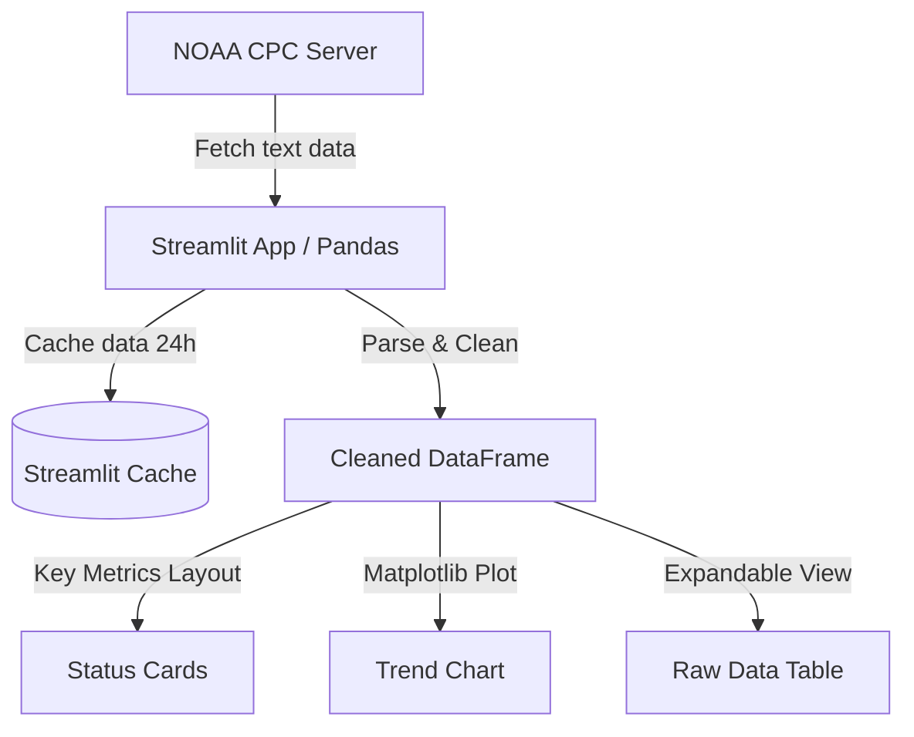

# System Patterns: ENSO RONI Dashboard

## System Architecture
The application is a single-page python web app built on **Streamlit** serving interactive visualizations using **Matplotlib** and managing data with **Pandas**.

## Key Decisions & Patterns
1. **Vertical/Long Parsing Pattern**:
   - The official NOAA RONI feed (`RONI.ascii.txt`) uses a vertical layout with headers `SEAS`, `YR`, and `ANOM`.
   - The parsing pattern maps `SEAS` to `Season` and `ANOM` to `RONI` directly, bypassing the need to wide-melt columns.
2. **Data Caching Pattern**:
   - Uses `@st.cache_data(ttl=86400)` to cache dataset downloads. This prevents repetitive server queries, ensuring the app runs fast while updating once per day.
3. **Responsive Visual Spacing**:
   - Matplotlib charts are configured to only display every 3rd season on the X-axis (`ax.set_xticks(range(0, len(df_recent), 3))`) to keep label text readable over a 24-month horizon.
